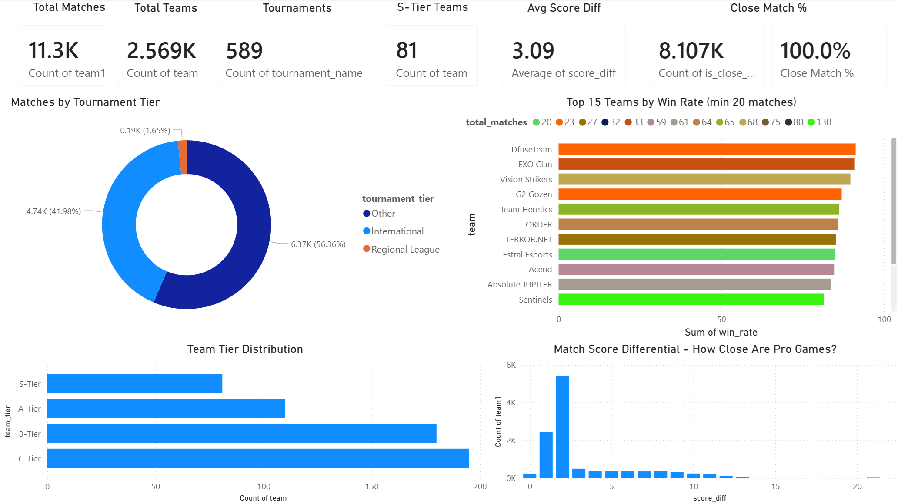
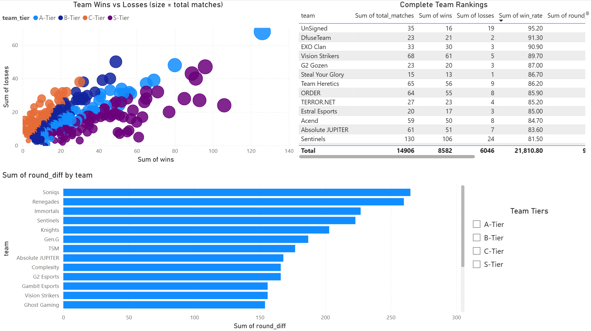
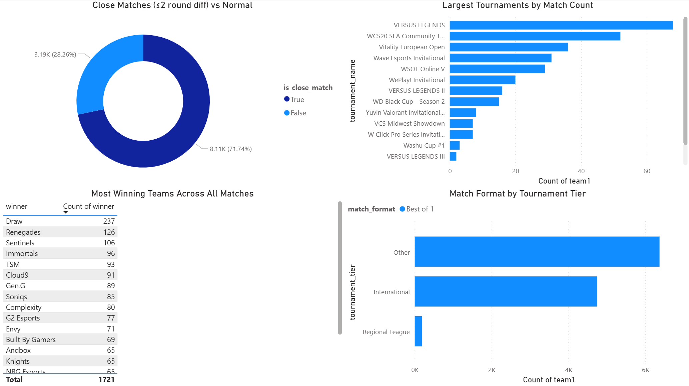
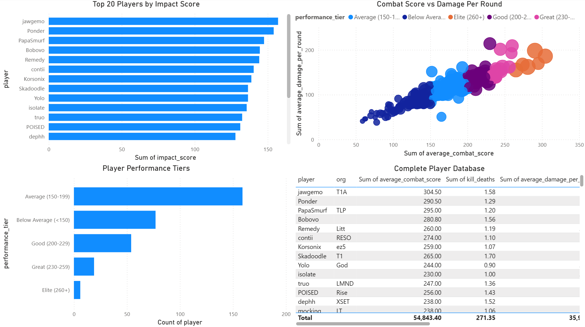

# VALORANT PRO SCENE TRACKER

An esports analytics dashboard tracking **11,300 pro matches** across **2,569 teams** and **589 tournaments** - featuring team rankings, match analysis, player performance metrics and competitive tier classification. Built with Python data enrichment and Power BI.



## PROJECT OVERVIEW

Valorant's competitive scene has exploded since launch, with hundreds of tournaments and thousands of teams competing globally. This project brings data analytics to the pro scene by:

1. **Python Analysis** - enriching VLR.gg match data with win rates, round differentials, team tiers, player impact scores and performance classifications
2. **Power BI Dashboard** - 4 page interactive explorer covering the pro scene overview, team intelligence, match patterns and player performance

## KEY FINDINGS

### The Pro Scene at Scale
- **11,300 matches** tracked across **589 tournaments** involving **2,569 unique teams** - showing the massive breadth of Valorant's competitive ecosystem
- **41.98% of matches are International-tier** events (Champions, Masters), while **56.3% are classified as Other** (community, grassroots, and smaller events) - demonstrating the healthy amateur-to-pro pipeline
- The average score differential is **3.09 rounds**, with **28.3% of all matches being close** (≤2 round difference) - pro games are genuinely competitive

### Team Hierarchy
- **81 teams qualify as S-Tier** (65%+ win rate with 20+ matches), while **C-Tier teams form the largest group** (~195 teams) - the competitive pyramid is steep
- **DfuseTeam leads all teams** at 91.3% win rate (23 matches), followed by **EXO Clan** (90.9%, 33 matches) and **Vision Strikers** (89.7%, 68 matches) - the Korean powerhouse's dominance is confirmed by data
- **Sentinels** are the most active top team with **130 matches** (81.5% win rate) - their longevity at the top is remarkable
- The wins vs losses scatter reveals a clear tier separation: S-Tier teams cluster in the bottom-right (high wins, low losses) while C-Tier teams spread across the middle

### Round Differential Tells the Real Story
- **Soniqs and Renegades** lead in cumulative round differential (~300 rounds ahead), meaning they don't just win - they dominate
- Round differential is a better indicator of team strength than win rate alone, as it captures how convincingly teams win their matches
- **Sentinels** rank 4th in round differential despite having the most matches - consistent dominance over a large sample

### Match Competitiveness
- The score differential histogram shows a strong right-skew: **most matches end with a 1-2 round gap**, confirming that Valorant's competitive format produces close, exciting games
- **237 matches ended in draws** - the highest single category in the "most winning" table, showing how evenly matched many teams are

### Player Performance (Astra Meta Snapshot)
- **jawgemo (T1A)** leads all players with a 304.5 ACS and 1.58 K/D - the standout performer in this data snapshot
- The ACS vs ADR scatter shows a **strong positive correlation** - players with high combat scores consistently deal more damage per round, validating ACS as a reliable performance metric
- **50.5% of players fall in the Average tier** (150-199 ACS), while only **6 players (1.9%) reach Elite status** (260+ ACS) - the elite tier is genuinely exclusive
- The performance tier pyramid mirrors what you'd expect: a large average base with progressively fewer players at each higher tier



## DASHBOARD PAGES

### Page 1: Pro Scene Overview
KPI cards (11.3K matches, 2.569K teams, 589 tournaments, 81 S-Tier teams, 3.09 avg score diff), tournament tier donut, top 15 teams by win rate, team tier distribution, score differential histogram

### Page 2: Team Intelligence
Wins vs losses scatter by tier, complete team rankings table, round differential top 20, team tier slicer

### Page 3: Match Insights
Close match distribution, largest tournaments by match count, most winning teams, match format by tournament tier



### Page 4: Player Performance
Top 20 players by impact score, ACS vs ADR scatter by performance tier, performance tier distribution, complete player database



## TOOLS AND TECHNOLOGIES

- **Python** - data enrichment, team ranking calculation, impact scoring
- **pandas / NumPy** - data transformation and analysis
- **Requests** - VLR API integration attempt
- **Power BI** - interactive 4-page dashboard
- **DAX** - Close Match % measure, calculated aggregations
- **VLR.gg / Kaggle** - pro match and player stat data sources

### Analytical Techniques Demonstrated
- Team ranking algorithm (win rate + match minimum thresholds)
- Composite impact scoring (weighted multi-metric formula)
- Role classification from stat patterns
- Tournament tier classification via keyword matching
- Match competitiveness analysis (score differential, close match %)

## PROJECT STRUCTURE

```
valorant-pro-scene-tracker/
├── data/
│   ├── results.csv                    # Raw VLR.gg match results (11.3K)
│   ├── stats.csv                      # Raw player stats (315)
│   ├── results_enriched.csv           # Enriched match data
│   ├── stats_enriched.csv             # Enriched player stats
│   └── team_rankings.csv              # Calculated team rankings
├── powerbi/
│   └── Valorant_Pro_Tracker.pbix      # Power BI dashboard
├── scripts/
│   └── prepare_data.py                # Data enrichment pipeline
├── images/
└── README.md
```

## GETTING STARTED

### Prerequisites
- Power BI Desktop
- Python 3.10+

### Setup
```bash
git clone https://github.com/rush2pranav/valorant-pro-scene-tracker.git
cd valorant-pro-scene-tracker

pip install pandas numpy requests
python scripts/prepare_data.py

# Open powerbi/Valorant_Pro_Tracker.pbix in Power BI Desktop
```

### Dataset
Download from [Kaggle - Valorant VLR.gg Results and Stats](https://www.kaggle.com/datasets/hidious/valorant-vlrgg-results-and-stats) and place CSV files in `data/`.

## WHAT I LEARNED

- **Team ranking algorithms need minimum thresholds** Without a minimum match count, teams with 2-0 records appear as 100% win rate "S-Tier" teams. Setting a 20-match minimum filters noise and reveals genuinely dominant teams - this is the same challenge real ranking systems like Elo and Glicko face.
- **Round differential is more informative than win rate** A team that wins 13-11 every match and a team that wins 13-2 have the same win rate but very different dominance levels. Cumulative round differential captures this nuance.
- **Composite scores require careful weighting** The impact score formula (ACS × 0.3 + KPR × 0.2 + ADR × 0.2 + FKPR × 0.15 + HS% × 0.15) was designed to balance fragging power, damage output and entry capability - each weight reflects the relative importance of that metric in pro play.
- **Esports data is messy** Inconsistent team names, missing timestamps, varied tournament naming conventions - cleaning pro esports data requires the same defensive coding as any real-world dataset.

## POTENTIAL EXTENSIONS

- Add map-specific win rate analysis per team
- Integrate agent pick/ban data from pro matches
- Build an Elo rating system that updates after each match chronologically
- Add head to head comparison tool for any two teams
- Track meta shifts by analyzing which agents appear in different tournament periods
- Deploy as a live-updating dashboard by scheduling VLR API pulls